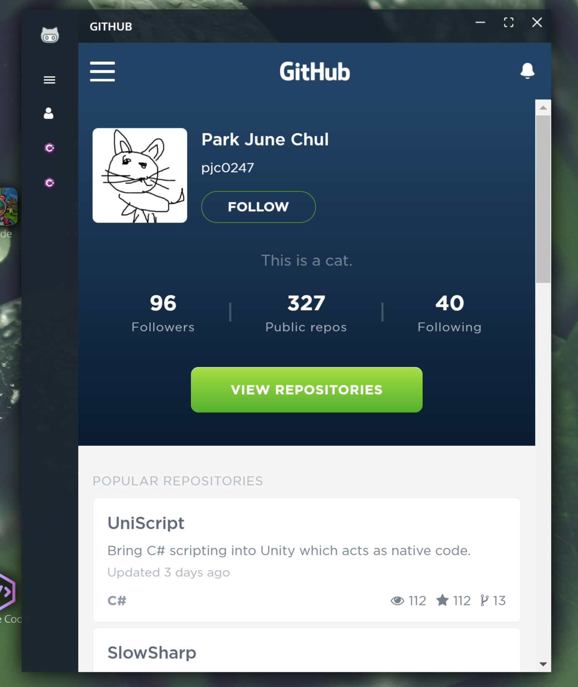
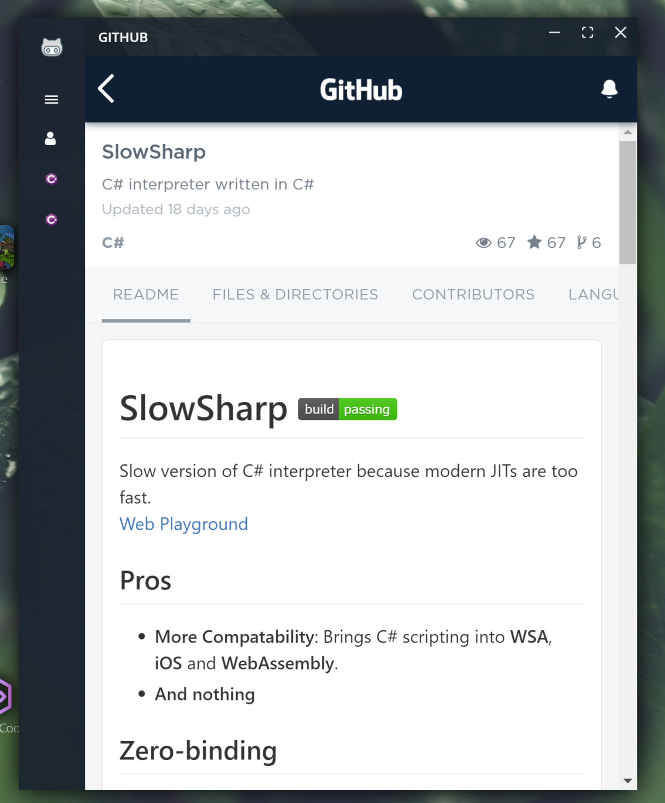
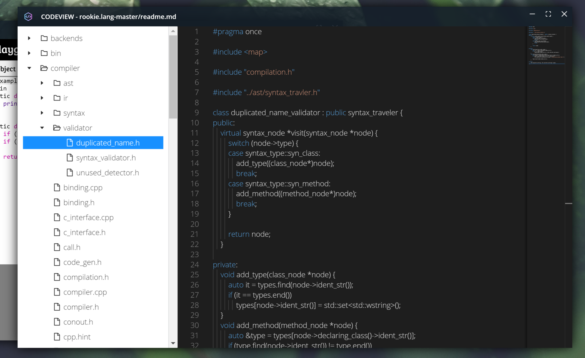
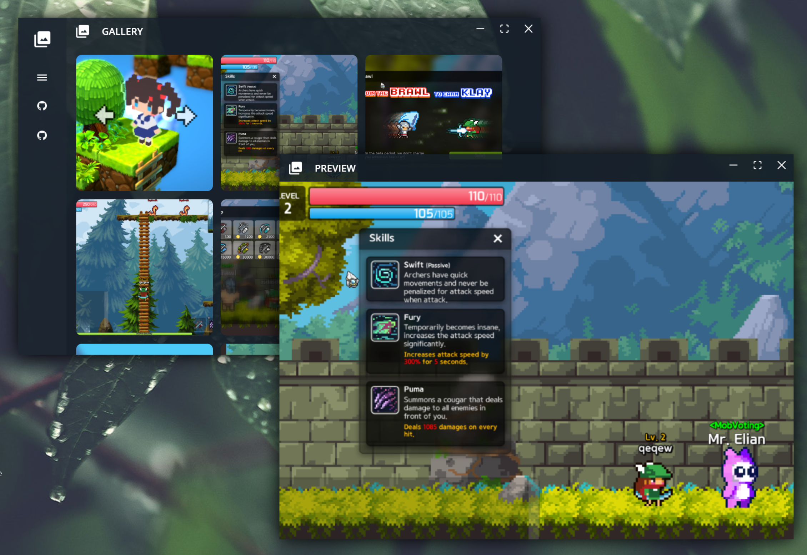

new-home-project
====

An OS-like portfolio template for creepy developers.


Creating an Application
----

```tsx
const GithubApp = {
  icon: require('asset/app/github/icon.png').default,
  width: 800,
  height: 1000,
  Component: <Github />
} as IApp;
```
```tsx
const onClickGithub = () => {
  App.launch(GithubApp);
};
```

[Blank Application](src/app/blank)


Retrieving `window` object
----
```tsx
const YourHandsomeApp = () => {
  const window = useWindow();

  const onClickClose = () => {
    window.close();
  };

  return (
    <>Hello</>
  );
};
```

Built-in Applications
----

#### Github

<div style="display:flex">


</div>

#### CodeView



#### Gallery


